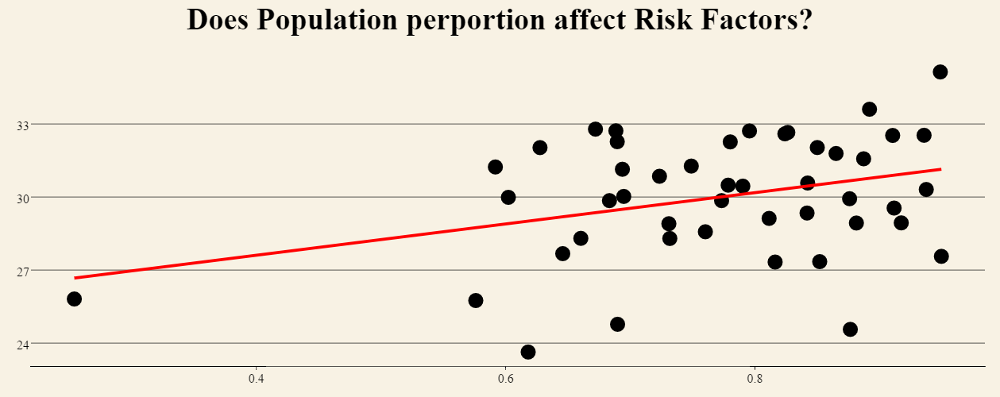
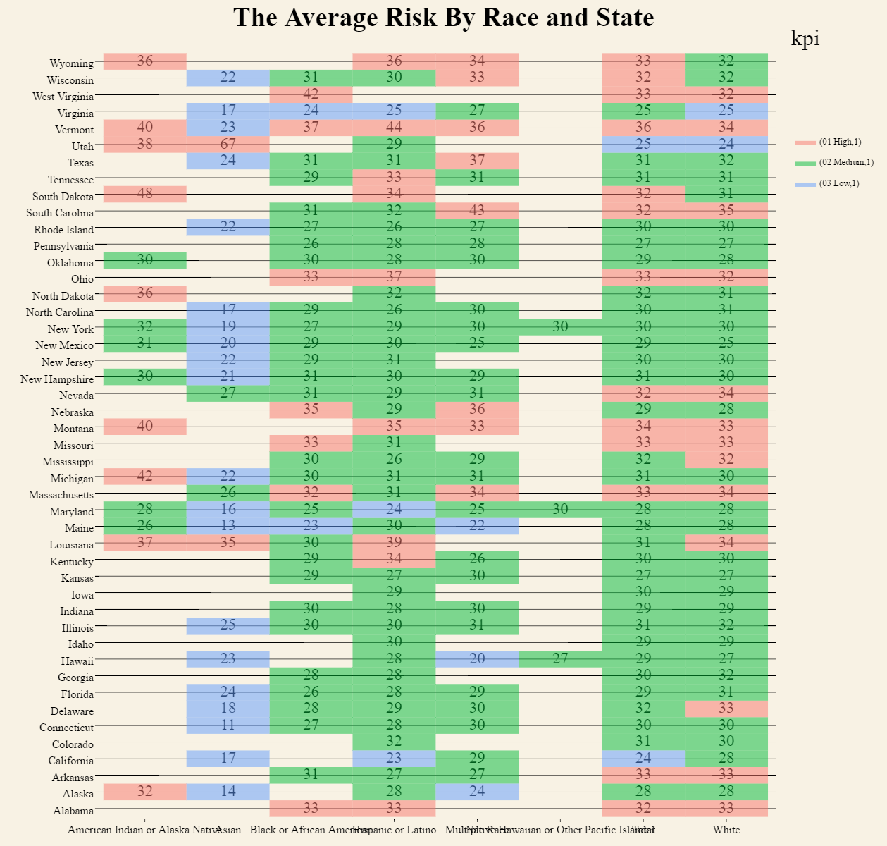
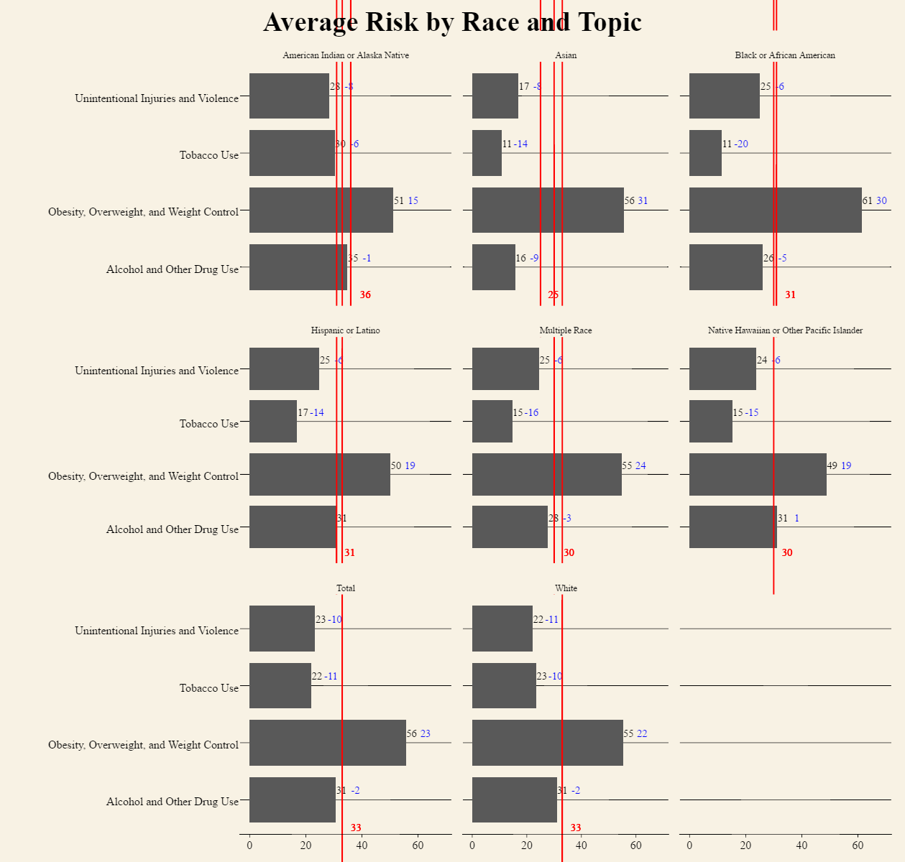

```{r}
sessionInfo()
```

```{r setup, include=FALSE}
knitr::opts_chunk$set(echo = TRUE, fig.align = "center")
options(max.print = 40)

```

#**Introduction**
This is our Final Project R-markdown document. Our group explored data from two public government databases. 
The first is titled "US Census population estimates, Income (American Community Survey, 2011-2015)". The dataset includes population estimates of Income categorized and subcategorized into groups according to age, race, and educational background.

and was sourced from the US Census Bureau datasets archived in data.world. 

The second is "DIR Cooperative Contract Sales Data – Fiscal 2010 to Present", which was sourced through the TX government database website (https://data.texas.gov/Business-and-Economy/DIR-Cooperative-Contract-Sales-Data-Fiscal-2010-to/w4x7-gfja/data). 

#**Extract-Translate-Load (ETL)**
In order to extract the pertinent data from our raw CSVs, we generated a number of R-scripts that tidied current data and excised nonrelevant data that were not used in our Tableau and ShinyApp visualizations. Our cleaned-up (post-ETL) versions were then uploaded to the data.world servers, available for downloading and querying.
Data manipulations will be shown for only one ACS CSV file, but similar methods were used for the remaining three files.

## 1. Raw (Pre-ETL) CSVs:
As you can see below, the raw csv contains data across more variables than were necessary for this project. 
```{r getpre}
library(knitr)
source("../01 Data/getpreINC.R")
kable(preINC, digits = 0)
```

## 2. ETL script to distill data:
Plyr and dplyr functions were used to filter out the pertinent information. Separate scripts were used for each file. 
```{r getetl}
source("../01 Data/etlINC.r", echo=TRUE, print.eval=FALSE, verbose=FALSE, keep.source=TRUE)
```
## 3. Finished (Post-ETL) CSV file:
Workable CSVs contain only national data grouped by state (excl. DC and Puerto Rico) and pertaining to population demographic delineations of age, sex, race, income, and employment.
The finished CSV documents were much smaller in size, and better enabled us to investigate trends and correlations between datasets.
```{r getpost}
library(knitr)
source("../01 Data/getpostINC.R")
kable(postINC, digits = 0)
```

# **Charts**
## Non-Aggregated Measures Analysis
[description]


## Aggregated Measures Analysis
[description]


## Scatter Plots
[description]


## Crosstabs
[description]


## Barcharts
[description]


## Joining Tables
[description]


## Data Blending
[description]


# **Link to Shiny app application**
Here is our link to our shiny app application: https://katzen.shinyapps.io/khlshiny/

# Here are our Shiny Plots

## Boxplot
It's a plotly boxplot that shows the distribution of the various risk factors by topic. You can change which topics you see when you get the data.


## Histogram
This histogram measures the frequency of risk factors as it relates to their intensity. Becasue the counts for each race were not equal, in order to compare them they are all normalized to where the largest count for a window equals one. Also, you can change the bin sizes on the fly.


## Scatter Plot
The labels aren't showing up for some reason, but the x axis is percentage of white people in a state and the y axis is that states average risk factor. It doesn't appear very well correlated and there is one outlier (Hawaii). 


## Crosstab
This is a cross tab that shows the various average risk factors in the boxes, depeding on what race is on the x axis and what state is on the y axis. Some values are missing unfortunatley. But that's to be expected. You wouldn't think Hawaii would have many American Indians right? The KPI is dependent on wether that risk factor is especially high or low.


## Barchart
We've got this wonderful barchart whose x labels won't show up. The x axis is risk factor values. It's faceted by Race and the y axis is topic. The black numbers represent how large of a risk factor it is and the blue numbers represent how far away it is from the window average risk factor, which is the red number. There really shouldn't be multiple red bars on the tops, but that only appears in the notebook file. If you go to the shinyapp, they aren't there. 

