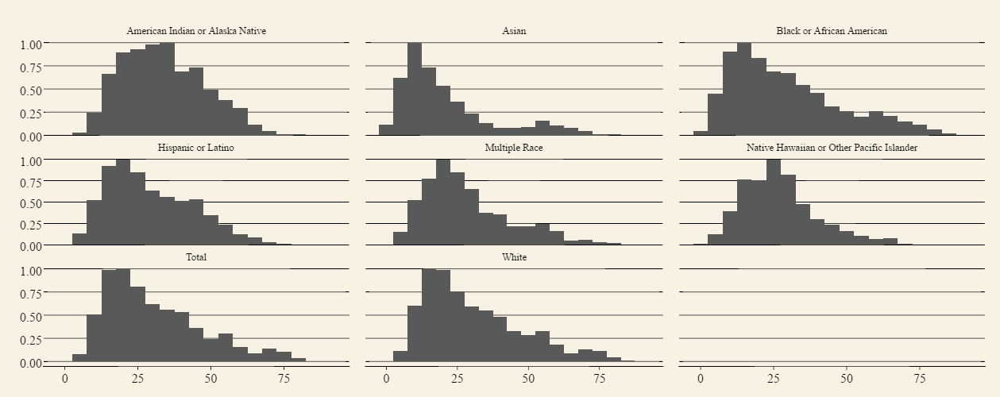

```{r}
sessionInfo()
```

```{r setup, include=FALSE}
knitr::opts_chunk$set(echo = TRUE, fig.align = "center")
options(max.print = 40)

```

#**Introduction**
This is our Final Project R-markdown document. Our group explored data from two public government databases. 
The first is titled "DASH - Youth Risk Behavior Surveillance System (YRBSS)". The dataset monitors six categories of priority health behaviors among youth and young adults. The data acquired is from 1991-2015, and can be accessed through data.world. The link for this data is: https://catalog.data.gov/dataset/dash-youth-risk-behavior-surveillance-system-yrbss-high-school

The remaining data was sourced from US national census data. We explored population demographics of education, income, employment, and race.

#**Extract-Translate-Load (ETL)**
In order to extract the pertinent data from our raw CSVs, we generated a number of R-scripts that tidied current data and excised nonrelevant data that were not used in our Tableau and ShinyApp visualizations. Our cleaned-up (post-ETL) versions were then uploaded to the data.world servers, available for downloading and querying.
Data manipulations will be shown for only one ACS CSV file, but similar methods were used for the remaining three files.

## 1. Raw (Pre-ETL) CSVs:
As you can see below, the raw csv contains data across more variables than were necessary for this project. 
```{r getpre}
library(knitr)
source("../01 Data/getpreMED.R")
kable(preMED, digits = 0)
```

## 2. ETL script to distill data:
Plyr and dplyr functions were used to filter out the pertinent information. Separate scripts were used for each file. 
```{r eval=FALSE, echo=TRUE}
code = readLines("../01 Data/etlMED.r")
show(code)
```

## 3. Finished (Post-ETL) CSV file:
Workable CSVs contain only national data grouped by state (excl. DC and Puerto Rico) and pertaining to population demographic delineations of age, sex, race, income, and employment.
The finished CSV documents were much smaller in size, and better enabled us to investigate trends and correlations between datasets.
```{r getpost}
library(knitr)
source("../01 Data/getpostMED.R")
kable(postMED, digits = 0)
```


# **Charts**
## Non-Aggregated Measures Analysis
Our first non-aggregated measures analysis was a boxplot that broke down youth behavioral survey responses down by grade and question type, allowing one to see how the responses change as the one progresses through the grades. Pages were set to flip through the data by year. Joins were used in this visualization to illustrate the median household income of the state where each data point was collected: lower income values are plotted in red, while higher income values are plotted in green. (we realized that the bunching of darker green circles around the center of the boxplots is most likely just a software effect of tableau when handling a high samplze size, rather that the data suggesting a relationship between highest median income and the average response value)

This visualization shows us a couple patterns and intersting things about risky behavior and youth:
First, some risk factors, such as physical fighting and suicide consideration, tend to decrease as one progresses through Highschool, while some factors remain flat (diet) and some increase (alcohol, cigarette, and marijuana use).
)


Related, we wondered what the differences between the oldest and most recent data values. This second histogram illustrates the differences in responses between 1991 (gold) and 2015 (purple), grouped again by grade and category. 
Some average greater risk data value seems to show a moderate decrease between the 24 years, such as physical fighting,  suicide consideration, currrent alcohol and cigarette use. Diet appears to have similar ranges of responses between the two years, while marijuana use was the only value to significantly increase in recent history.


## Aggregated Measures Analysis
[description]


## Scatter Plots
[description]


## Crosstabs
Our crosstab visualization illustrated the KPI of young adults, subcategorized by sex and race. 

Our KPI weighted data from the greater risk data questions, the lesser risk data questions, factored by the proportion of adults with bachelor's degree in that geographic state. 

You can see the trends for race grouped by gender. There appears to be a some commonality between the groups and subgroups regarding their health risk for each variable. Weight loss seems to be the most at-risk variable, followed by alcohol use for girls and physical fighting (and alcohol use) for boys. 


The crosstab was restructred, this time grouping the sexes next to each other in each race. This grouping suggests that more variation exists between females of different races, than the variation that exists between the males and females of the same race.  

Lastly, our KPI heatmap showed a significant relationship between geographic location and KPI score. The map below shows groupings of KPI values, with states geographically closer to each other sharing similar KPI scores as well. 


## Barcharts
[description]


# **Link to Shiny app application**
Here is our link to our shiny app application: https://katzen.shinyapps.io/khlshiny/

# Here are our Shiny Plots

## Boxplot
It's a plotly boxplot that shows the distribution of the various risk factors by topic. You can change which topics you see when you get the data.


## Histogram
This histogram measures the frequency of risk factors as it relates to their intensity. Becasue the counts for each race were not equal, in order to compare them they are all normalized to where the largest count for a window equals one. Also, you can change the bin sizes on the fly.


## Scatter Plot
The labels aren't showing up for some reason, but the x axis is percentage of white people in a state and the y axis is that states average risk factor. It doesn't appear very well correlated and there is one outlier (Hawaii). 


## Crosstab
This is a cross tab that shows the various average risk factors in the boxes, depeding on what race is on the x axis and what state is on the y axis. Some values are missing unfortunatley. But that's to be expected. You wouldn't think Hawaii would have many American Indians right? The KPI is dependent on wether that risk factor is especially high or low.


## Barchart
We've got this wonderful barchart whose x labels won't show up. The x axis is risk factor values. It's faceted by Race and the y axis is topic. The black numbers represent how large of a risk factor it is and the blue numbers represent how far away it is from the window average risk factor, which is the red number. There really shouldn't be multiple red bars on the tops, but that only appears in the notebook file. If you go to the shinyapp, they aren't there. 

