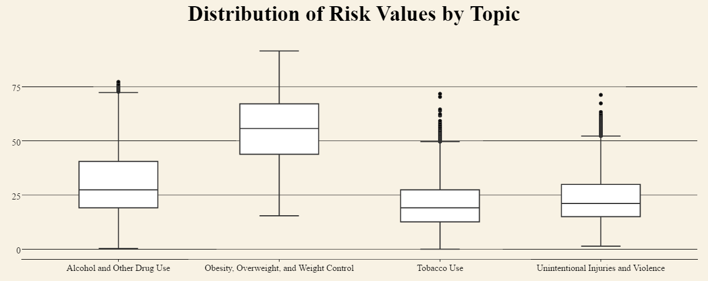

```{r, sessioninfo}
sessionInfo()
```

```{r setup, include=FALSE}
knitr::opts_chunk$set(echo = TRUE, fig.align = "center")
options(max.print = 40)

```

#**Introduction**
This is our Final Project R-markdown document. Our group explored data from two public government databases. 
The first is titled "DASH - Youth Risk Behavior Surveillance System (YRBSS)". The dataset monitors six categories of priority health behaviors among youth and young adults. The data acquired is from 1991-2015, and can be accessed through data.world. The link for this data is: https://catalog.data.gov/dataset/dash-youth-risk-behavior-surveillance-system-yrbss-high-school

The DASH survey asked questions pertaining to youth risk behavior on both positive and negative ends of the spectrum. "Greater Risk Data Values" are quantitative scores gathered from affirmative responses to questions pertaining to health-detrimental behaviors. "Lesser Risk Data Values" are quantitative scores gathered from affirmative responses to questions pertaining to health-beneficient behaviors.

The remaining data was sourced from US national census bureau data. We explored population demographics of education, income, employment, and race across the nation, by state.

##**Extract-Translate-Load (ETL)**
In order to extract the pertinent data from our raw CSVs, we generated a number of R-scripts that tidied current data and excised nonrelevant data that were not used in our Tableau and ShinyApp visualizations. Our cleaned-up (post-ETL) versions were then uploaded to the data.world servers, available for downloading and querying.
Data manipulations will be shown for only one ACS CSV file, but similar methods were used for the remaining three files.

### 1. Raw (Pre-ETL) CSVs:
As you can see below, the raw csv contains data across more variables than were necessary for this project. 
```{r raw}
library(knitr)
source("../01 Data/getpreMED.R")
sample(preMED, size=15)
```

### 2. ETL script to distill data:
Plyr and dplyr functions were used to filter out the pertinent information. Separate scripts were used for each file. 
```{r etlscript, echo=TRUE}
source("../01 Data/etlMED.R", echo=TRUE)
```


### 3. Finished (Post-ETL) CSV file:
Workable CSVs contain only national data grouped by state (excl. DC and Puerto Rico) and pertaining to population demographic delineations of age, sex, race, income, and employment.
The finished CSV documents were much smaller in size, and better enabled us to investigate trends and correlations between datasets.
```{r cooked}
library(knitr)
source("../01 Data/getpostMED.R")
sample(postMED, size=15)
```


# **Very Interesting Data**
## Non-Aggregated Measures: Boxplots Analysis
This boxplot breaks down the DASH youth behavioral survey responses down by grade and question type, illustrating how certain behaviors increase and others attenuate as students progress through the grades. Pages were set to flip through the data by year. Joins were used in this visualization to illustrate the median household income of the state where each data point was collected: lower income values are plotted in red, while higher income values are plotted in green (Household median income values were sourced from US census bureau data and added onto tableau by use of joins). (we realized that the bunching of darker green circles around the center of the boxplots is most likely just a software effect of tableau when handling a high samplze size, rather that the data suggesting a relationship between highest median income and the average response value)

This visualization shows us a couple patterns and intersting things about risky behavior and youth:
First, some risk factors, such as physical fighting and suicide consideration, tend to decrease as one progresses through Highschool, while some factors remain flat (such as diet) and some increase (alcohol, cigarette, and marijuana use).


After seeing these values, we then wondered how the values would change from the first year of the survey to the most recent year's data. This second boxplot blow illustrates the differences in responses between 1991 (gold) and 2015 (purple), grouped again by grade and category. 
Some average greater risk data value seems to show a moderate decrease between the 24 years, such as physical fighting,  suicide consideration, currrent alcohol and cigarette use. Diet appears to have similar ranges of responses between the two years, while marijuana use was the only value to significantly increase in recent history.


## Crosstabs Analysis
Our crosstab visualization illustrated the KPI of young adults, subcategorized by sex and race. 

Our KPI weighted data from the greater risk data questions (negative health-impact values), the lesser risk data questions (positive health-impact data values)(Lesser risk data values  were countervalued against the greater risk data values), factored by the proportion of adults with bachelor's degree in that geographic state (this piece of data was sourced from joining with US Census Bureau Data). Our KPI measured the positive health factor of any of these subgroupings.

You can see the trends for race grouped by gender. There appears to be a some commonality between the groups and subgroups regarding their health risk for each variable. Weight loss seems to be the most at-risk variable, followed by alcohol use for girls and physical fighting (and alcohol use) for boys. 

However, the important thing to note about this graph is that between the differennt races within the female grouping, there is a significant degree of variation amongst the responses. The same is true for males. This fact led me to my next crosstab graph below.


We restructured the crosstab, this time separating responses by race, grouping the males and females responses of each race together. As you can see from the visualization below, there appears to be a higher correlation between the responses when grouped by race and comparing gender, as contrasted with the graph above that grouped responses by gender and compared race.
An analogous way of saying this would be to say that the data suggests that females are more similar to their male counterparts of equivalent race than females are to other females of a different race, in general.


Lastly, our KPI heatmap showed a significant relationship between geographic location and KPI score. The map below shows groupings of KPI values, with states geographically closer to each other sharing similar KPI scores as well.


# Other Great Visualizations 
## Aggregated Measures Analysis
The visualization below is the histogram that compare average greater risk data value and lesser risk data value. As you can see the sum of the average greater risk data value and lesser risk data values is 100. The survey has certain questions that measure the degree of the risk value.Carlifornia has the most lesser risk data value of 76.37. And Vermont has the highest greater risk data value of 35.13. 


## Scatterplots
Our scatterplot plotted the average values of the Greater Risk Data Value Questions against the proportion of caucasian (white) individuals in the state. While seemingly uncorrelated, there is a small positive correlation between the average Risk scores and the proportion of white individuals in the state. Joins were used to attach US census bureau data of proportions of race by state to Youth Risk Surveillance data. 


## Barcharts
This bar chart represents average of greater risk data value from different survey short questions. There are a lot of interesting fact we can get from this chart. We find out that 1. Asians have the lowest average of greater risk data values for some of the questions 2. Males have the greater risk data value compare to females for the weight loss question As you can see on the graph, every single short question is divided into race and gender. Asians have lowest average of greater risk data values on the questions of alcohol uses, current cigarette uses, and current marijuana uses. Asians are less risky and less affected by alcohol uses, cigarette uses and marijuana uses.

In the last cell of the bar chart. Males has the greater risk data value when comparing to females. This means that males are more easily affected by the intaking food compares to females 


# **Link to Shiny app application**
Here is our link to our shiny app application: https://katzen.shinyapps.io/khlshiny/

# Here are our Shiny Plots
## Boxplot
It's a plotly boxplot that shows the distribution of the various risk factors by topic. You can change which topics you see when you get the data.


## Histogram
This histogram measures the frequency of risk factors as it relates to their intensity. Becasue the counts for each race were not equal, in order to compare them they are all normalized to where the largest count for a window equals one. Also, you can change the bin sizes on the fly.


## Scatter Plot
The labels aren't showing up for some reason, but the x axis is percentage of white people in a state and the y axis is that states average risk factor. It doesn't appear very well correlated and there is one outlier (Hawaii). 


## Crosstab
This is a cross tab that shows the various average risk factors in the boxes, depeding on what race is on the x axis and what state is on the y axis. Some values are missing unfortunatley. But that's to be expected. You wouldn't think Hawaii would have many American Indians right? The KPI is dependent on wether that risk factor is especially high or low.


## Barchart
We've got this wonderful barchart whose x labels won't show up. The x axis is risk factor values. It's faceted by Race and the y axis is topic. The black numbers represent how large of a risk factor it is and the blue numbers represent how far away it is from the window average risk factor, which is the red number. There really shouldn't be multiple red bars on the tops, but that only appears in the notebook file. If you go to the shinyapp, they aren't there. 

